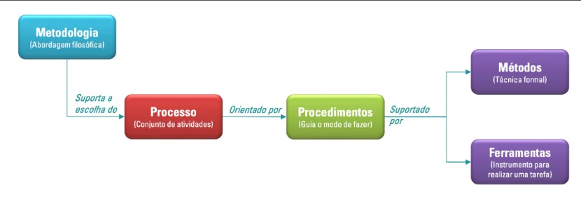

# 1 Visão Geral do Produto e do Projeto
### Versão 1.8

## 1.1 Problema
### Contexto
Muitos agricultores enfrentam dificuldades no gerenciamento eficaz de suas plantações devido à falta de ferramentas adequadas para monitorar e registrar atividades agrícolas. Além disso, a falta de sistemas de previsão meteorológica afeta negativamente a capacidade dos agricultores se prepararem para condições climáticas adversas, como chuvas intensas e secas, que podem prejudicar certas culturas.

### Detalhamento do Problema
- **Falta de Controle e Registro:** Agricultores não possuem um histórico das atividades agrícolas, incluindo plantio, colheita, uso de insumos e outro custos adicionais.
- **Previsão Meteorológica Inadequada:** Não há um aplicativo eficaz para prever o tempo com antecedência suficiente, o que impede a preparação adequada para condições climáticas adversas como chuvas intensas e secas prolongadas.
- **Gestão Financeira Ineficiente:** Sem registros detalhados, os agricultores têm dificuldades para calcular os custos e lucros de cada plantação.

### Diagrama de Ishikawa
O diagrama abaixo representa o problema central do gerenciamento de plantações e ajuda a visualizar e entender as origens do problema:

Figura 1: Diagrama espinha de peixe

## Justificativa
O desenvolvimento dessa aplicação mobile visa solucionar os principais problemas enfrentados pelos agricultores, proporcionando uma ferramenta robusta para o gerenciamento eficaz das plantações, aumentando a produtividade e a lucratividade das operações agrícolas. 

Essa solução pode contribuir para a resolução do problema por meio da centralização das informações em um aplicativo. Nesse aplicativo o agricultor pode gerenciar suas plantações(Cadastrar, Editar, Consultar e Exclir), gerenciar as colheitas dessas plantações cadastradas, gerenciar o uso de insumos, vizualizar relatorios das atividades realizadas em cada plantação, vizualizar informações climaticas e gerenciar o estoque de produtos.

Espera-se que a implementação dessa solução não apenas resolva os problemas de desorganização e falta de controle, mas também otimize os processos agrícolas, contribuindo para o aumento da produtividade e rentabilidade dos pequenos e médios produtores rurais.

## 1.2 Declaração de Posição do Produto
A fim de aprimorar a gestão agrícola e fornecer uma ferramenta eficiente para pequenos e médios produtores rurais, o desenvolvimento do **CulturaTech** foi cuidadosamente planejado. Este aplicativo visa abordar diversas necessidades identificadas no setor agrícola, oferecendo funcionalidades inovadoras e acessíveis para os agricultores. A seguir, apresentamos a declaração de posicionamento do produto, detalhando seu propósito, escopo e diferenciais.

### Tabela 1: Posição do Produto

| **Item**               | **Descrição**                                                                                                                                                                                                   | **Comentário**                                                                                                                                                              |
|------------------------|-----------------------------------------------------------------------------------------------------------------------------------------------------------------------------------------------------------------|-----------------------------------------------------------------------------------------------------------------------------------------------------------------------------|
| **Para**               | Agricultores e pequenos produtores rurais.                                                                                                                                                                      | Foco em um público que carece de ferramentas tecnológicas acessíveis para gerenciar suas plantações de forma eficiente.                                                     |  
| **Necessidade**        | Facilitar o gerenciamento completo das plantações, desde o cadastro do plantio até a colheita, com previsões climáticas precisas.                                                                                          | A necessidade identificada reflete a falta de controle organizado e de informações meteorológicas confiáveis no dia a dia dos pequenos e médios produtores.                 |
| **O (nome do produto)**| É um aplicativo mobile para controle de plantações, gestão financeira e previsão meteorológica com o nome CulturaTech.                                                                                          | A proposta do produto é oferecer uma solução centralizada e acessível para a gestão agrícola, usando tecnologia mobile.                                                     |
| **Que**                | Fornece aos agricultores controle sobre suas plantações, incluindo histórico de plantio, colheita, atividades agrícolas como adubação, fertilização, etc.                                                       | As funcionalidades abrangem as etapas do processo agrícola, facilitando a tomada de decisão baseada nas informações obtidas durante esse processo.                          |
| **Ao contrário**       | Sistemas manuais ou inexistentes, que não fornecem dados centralizados e precisos.                                                                                                                              | Diferencia-se das práticas tradicionais (como anotações em papel), que são ineficazes para fornecer uma visão integrada da plantação.                                       |
| **Nosso produto**      | Oferece uma solução integrada, com previsões meteorológicas e relatórios financeiros sobre cada plantação cadastrada, diferenciando-se por atender às necessidades específicas de pequenos e médios produtores. | A integração das funcionalidades, especialmente as notificações antecipadas de chuvas, é um diferencial competitivo importante.                                             |

## 1.3 Objetivos do Produto
- **Melhorar a Gestão das Plantações:**
  - **Cadastro e Monitoramento:** Permitir que os agricultores registrem e monitorem detalhadamente cada plantação, incluindo a quantidade de insumos utilizados, as colheitas que foram realizadas e os custos adicionais dessa plantação.
  - **Histórico de Atividades:** Manter um histórico completo e acessível das atividades realizadas nas plantações, visando uma análise futura e melhor tomada de decisões.
- **Aumentar a Precisão das Previsões Meteorológicas:**
  - **Notificações Antecipadas:** Implementar um sistema de notificações meteorológicas que avise os agricultores, com antecedência mínima de 12 horas, sobre a previsão de chuva ou outras condições climáticas adversas.
  - **Preparação para Clima Adverso:** Ajudar os agricultores a se prepararem adequadamente para condições climáticas adversas, diminuindo perdas e danos às plantações.
- **Otimizar a Gestão Financeira:**
  - **Relatórios Financeiros Detalhados:** Fornecer ferramentas para gerar relatórios detalhados sobre custos, receitas e lucros das plantações.
  - **Controle de Insumos:** Monitorar e registrar o uso de insumos agrícolas, como fertilizantes e pesticidas, para otimizar custos e melhorar a eficiência.

## 1.4 Tecnologias a Serem Utilizadas
### Linguagens, Frameworks e Bibliotecas
- React Native: Linguagem utilizada para o frontend de aplicativos mobile;
- Expo: Plataforma para desenvolvimento de aplicativos;
- NodeJS: Framework de JavaScript para o backend da aplicação;
- Axios: Biblioteca de JS para realizar requisições HTTTP;
- Express: Framework do NodeJS utilizado para construir APIs de comunicação;
- Sequelize: ORM para NodeJS que simplifica a interação com o banco de dados.

### Design
- Figma;
- Canva;
- React Native Paper e React Native Elements (Biblioteca de UI).

### Banco de Dados
- SQLite.

### APIs
- HGBrasil: Para previsão do tempo.

### Ferramentas de Desenvolvimento
- Visual Studio Code;
- Git;
- GitHub;
- Expo CLI;
- Android Studio;
- Insomnia: Para realização de teste;
- SQLiteStudio: Para a vizualização do banco de dados.

### Metodologia
- Ágil.
- **Processo:**
  - SCRUM e XP.

# 2 Visão Geral do Projeto

## 2.1 Ciclo de Vida do Projeto de Desenvolvimento de Software

Figura 2: Ciclo de vida do projeto

### Metodologia

Usando um ciclo de vida ágil como metodologia para responder bem às frequentes mudanças, realizar entregas rápidas e obter feedbacks constantes do cliente. Essa abordagem permite um desenvolvimento centrado no cliente, garantindo a qualidade do produto.

### Processo

- **Scrum**: Utilizando Scrum para estruturar e gerenciar o projeto em constante comunicação com o cliente, com entregas frequentes.
- **XP (Extreme Programming)**: Usa feedback rápido e comunicação com alta taxa de disponibilidade para maximizar a entrega de valor, por meio de um cliente no local, uma abordagem de planejamento específica e testes constantes.

### Procedimentos

#### Planejamento
- Dividir o **Product Backlog** em tarefas menores e organizá-las por prioridade.
- Usar técnicas como **Story Mapping** para identificar prioridades.

#### Desenvolvimento
- **Práticas do XP**: Programação em pares, com dois desenvolvedores trabalhando juntos no mesmo código.
- **Práticas do Scrum**: Integração contínua, verificando constantemente o código para evitar problemas quando adicionada uma nova funcionalidade.

#### Entrega e Feedback
- Liberar **releases** durante o processo de desenvolvimento, versões incrementais.
- Obter feedback do cliente para possíveis ajustes.

### Métodos

- **Acompanhamento de Projeto**: Direto com o **Project Owner**, dando feedbacks sobre a aplicação aos desenvolvedores, evitando erros de interpretação.
- **Verificação e Validação**: Conjunto de atividades conduzidas ao longo do ciclo de vida de um projeto de software para garantir a qualidade do produto entregue ao final do desenvolvimento.
- **Processos Formais de Entrega**: Validação rápida e ágil.

### Ferramentas

- **React Native**: Front-end.
- **Node.js**: Back-end.
- **Figma**: Protótipo.
- **Canva**: Design.
- **GitHub**: Controle de versão.

## 2.2 Organização do Projeto

### Tabela 2: Organização do Projeto

| **Papel**                 | **Atribuições**                                                                                                    | **Responsável**                    | **Participantes**                   |
|---------------------------|--------------------------------------------------------------------------------------------------------------------|------------------------------------|-------------------------------------|
| **Dono do produto**       | Atualizar o escopo do produto, organizar o escopo das sprints, validar as entregas                                 | Gabriel Berto                      | Gabriel Berto, Will Sales           |
| **Analista de qualidade** | Garantir a qualidade do produto, garantir o cumprimento do conceito de pronto, realizar inspeções de código        | Equipe do Projeto                  | Equipe do Projeto                   |
| **Desenvolvedor**         | Codificar o produto, codificar testes unitários, realizar refatoração                                              | Equipe do Projeto                  | Equipe do Projeto                   |
| **Scrum Master**          | Garantir a aplicação das práticas ágeis, remover impedimentos e facilitar a colaboração                            | Joao Pedro Ferreira Moraes         | Joao Pedro Ferreira Moraes          |
| **Cliente**               | Fornecer os requisitos iniciais, priorizar o Product Backlog, garantir que o produto atenda ao valor esperado      | Will Sales                         | Will Sales                          |

# 2.3 Planejamento das Fases e/ou Iterações do Projeto

### Tabela 3: Planejamento do Projeto

| **Sprint** | **Desenvolvimento (Entrega)**                                                                | **Data Início** | **Data Fim** | **Entregável(eis)**        | **Responsáveis**      | **% conclusão** |
|------------|----------------------------------------------------------------------------------------------|-----------------|--------------|----------------------------|-----------------------|-----------------|
| 1          | Definição do Produto                                                                         | 22/11/2024      | 29/11/2024   |                            | Equipe do Projeto     | 100%            |
| 2          | Desenvolvimento de Documento de Visão                                                        | 29/11/2024      | 06/12/2024   | Documento de Visão         | Equipe do Projeto     | 100%            |
| 3          | Desenvolvimento do Documento de arquitetura                                                  | 11/12/2024      | 18/12/2024   | Documento de arquitetura   | Equipe do Projeto     | 100%            |
| 4          | Desenvolvimento do design das telas no Figma                                                 | 20/12/2024      | 27/12/2024   |                            | Equipe do Projeto     | 100%            |
| 5          | Feriado                                                                                      | 27/12/2024      | 03/01/2025   | Feriado                    | Equipe do Projeto     |                 |
| 6          | Desenvolvimento do Front-End do aplicativo                                                   | 03/01/2025      | 10/01/2025   |                            | Equipe do Projeto     | 100%            |
| 7          | Desenvolvimento do Modulos de plantação e a Previsão do tempo                                | 10/01/2025      | 17/01/2025   |                            | Equipe do Projeto     | 100%            |
| 8          | Desenvolvimento dos Modulos de colheitas, Estoque, Custos                                    | 17/01/2025      | 24/01/2025   |                            | Equipe do Projeto     | 100%            |
| 9          | Desenvolvimento do Modulo de Insumos, Relacionamentos do banco de dados, integração geral    | 24/01/2025      | 31/01/2025   |                            | Equipe do Projeto     | 80%             |
| 10         | Desenvolvimento do Backup de Dados, Notificacoes, e detalhes finais                          | 31/01/2025      | 07/02/2025   |                            | Equipe do Projeto     |                 |
| 11         | Testes do Software e correção de bugs                                                        | 07/02/2025      | 10/02/2025   |                            | Equipe do Projeto     |                 |

## 2.4 Matriz de Comunicação

- **Monitoramento do progresso do projeto:**
 - A duração de cada Sprint é de uma semana.
 - A comunicação será realizada de forma periódica para garantir o acompanhamento contínuo das atividades.
 - Transparência no progresso do projeto.

### Tabela 4: Matriz de Comunicação
| **Descrição**                                                         | **Área/Envolvidos**          | **Periodicidade**                 | **Produtos Gerados**                                                                  |
|-----------------------------------------------------------------------|------------------------------|-----------------------------------|---------------------------------------------------------------------------------------|
| Acompanhamento das Atividades em Andamento                            | Equipe do Projeto            | Semanal                           | Ata de reunião / Gravação, Relatório de situação do projeto                           |
| Acompanhamento dos Riscos, Compromissos, Ações Pendentes, Indicadores | Equipe do Projeto            | Quinzenal                         | Relatório de situação do projeto                                                      |
| Comunicar situação do projeto                                         | Equipe / Professor / Monitor | Semanal                           | Ata de reunião / Gravação, Relatório de situação do projeto                           |
| Feedback do Cliente                                                   | Will, Gabriel                | Ao final de cada sprint (Semanal) | Relatório de feedback                                                                 |

## 2.5 Gerenciamento de Riscos

- **Identificação dos riscos**
  - Relatório de feedback
  - Detecção de riscos possíveis e detectáveis em cada fase do projeto, com base em análise de contexto e histórico.

- **Análise e Avaliação**
  - Grau de exposição de cada risco identificado. Riscos com alta probabilidade e impacto exigem ações de mitigação imediatas.

- **Revisão Periódica**
  - A lista de riscos será revisada regularmente para garantir que os riscos foram identificados e que novos riscos não passaram despercebidos.

- **Registro e Monitoramento**
  - Todos os riscos serão registrados no relatório de situação do projeto, com atualização constante conforme necessário.

### Tabela 5: Gerenciamento de Risco

| **Risco**                | **Grau de exposição** | **Mitigação**                                    | **Plano de Contingência**                      |
|--------------------------|-----------------------|-------------------------------------------------|------------------------------------------------|
| Atraso nas entregas      | Alto                  | Alinhar cronograma com equipe, ajustes semanais | Reforçar equipes, ajustes de prioridade nas tarefas |
| Falha na comunicação     | Médio                 | Reuniões semanais para alinhamento              | Uso de ferramentas de comunicação adicionais   |
| Problemas técnicos       | Alto                  | Testes contínuos, suporte técnico dedicado      | Soluções alternativas para problemas críticos  |
| Mudança nos requisitos   | Médio                 | Validação constante com o cliente               | Ajuste do escopo, renegociação de prazos       |
| Falta de recursos humanos| Baixo                 | Planejamento de pessoal, capacitação contínua   | Redistribuição de tarefas                                               |

## 2.6 Critérios de Replanejamento

O replanejamento em um projeto de software ocorre quando há a necessidade de ajustar o 
planejamento original devido a mudanças, imprevistos ou a detecção de que o projeto está 
fora do curso. O replanejamento visa realinhar os objetivos, prazos e recursos de modo a 
garantir que o projeto continue progredindo de forma eficiente e atenda aos requisitos 
estabelecidos. 

Os critérios de replanejamento geralmente são baseados em indicadores que sinalizam a 
necessidade de ajustes 

- Atraso no cronograma
  - Número excessivo de atrasos nas entregas que torna necessário a alteração no cronograma
  -  Mudanças de prioridades podem causar atrasos sendo necessária a alteração no cronograma
 
- Problemas de qualidade
  - Software apresenta quantidade de defeitos grande será necessário replanejar a alocação de tempo para testes, correções e validações
  - Durante a execução do projeto forem observadas falhas em atender aos padrões de qualidade
   
- Mudança nos requisitos
  - Novos requisitos ou mudanças nos que já existem podem exigir ajustes no projeto
  - Se os requisitos fornecidos inicialmente estavam incompletos ou foram mal interpretados, pode ser necessário replanejar as entregas  

- Falta de recurso humano
   - Caso a equipe de desenvolvimento ou outros recursos necessários não estejam disponíveis ou não possuam a competência necessária, será preciso ajustar o plano

# 3 Processo de Desenvolvimento de Software

## 3.1 Metodologia
Adotamos um ciclo de vida ágil baseado nas metodologias Scrum e XP, priorizando respostas rápidas às mudanças e entregas frequentes para obter feedbacks constantes do cliente. Essa abordagem garante um desenvolvimento centrado no cliente e assegura a qualidade do produto ao longo do processo.

## 3.2 Principais etapas do processo:

### Planejamento:
- Divisão do Product Backlog, criado e priorizado com o cliente.
- Uso de técnicas como Story mapping para definir prioridades e funcionalidades.
- As tarefas priorizadas são distribuídas entre as Sprints (ciclo de trabalho de curta duração).

### Desenvolvimento:
- **Práticas de Scrum:**
  - Desenvolvimento em Sprints (ciclos curtos de 1-2 semanas).
  - Revisões periódicas do progresso do Sprint.
- **Práticas de XP:**
  - Programação em dupla para maior qualidade e compartilhamento de conhecimento.
  - Testes constantes e integração contínua para minimizar problemas.

### Entrega e Feedback:
- Liberação de releases intermediárias para validação contínua do cliente.
- Obtenção de feedback imediato para ajustes e melhorias.

### Verificação e Validação:
- Atividades contínuas ao longo do ciclo de vida para garantir a qualidade do produto.
- Processos ágeis de validação, realizados em conjunto com o cliente.

### Papeis e Responsabilidades:
- **Product Owner (PO):** Define as prioridades, valida as entregas e oferece feedback constante à equipe.
- **Scrum Master:** Facilita os ritos do Scrum e garante que a equipe siga o processo.
- **Equipe de Desenvolvimento:** Implementa as funcionalidades, realiza testes e entrega os incrementos.
- **Cliente:** Participa ativamente com feedbacks e valida as entregas.

### Ferramentas Utilizadas:
- **React Native:** Desenvolvimento do front-end.
- **Node.js:** Desenvolvimento do back-end.
- **Figma:** Criação de protótipos.
- **Canva:** Design de elementos gráficos.
- **Github:** Controle de versão e colaboração de códigos.

# 4 Declaração de Escopo do Projeto

## 4.1 Backlog do Produto

Os itens de backlog do produto foram obtidos a partir de entrevistas com o P.O., e em seguida, refinados para apresentar as funcionalidades desejadas no produto final.

### Tabela 6: Backlog do Produto Inicial

| **ID** | **História**                 | **Prioridade** |
|--------|------------------------------|----------------|
| 01     | Gerenciar Plantação          | Muito Alta     |
| 02     | Gerenciar Colheita           | Muito Alta     |
| 03     | Gerenciar Estoque            | Alta           |
| 04     | Gerenciar Insumos            | Muito Alta     |
| 05     | Gerenciar Custos Adicionais  | Alta           |
| 06     | Gerenciar Custos Gerais      | Alta           |
| 07     | Gerar Relatorios em PDF      | Muito Alta     |
| 08     | Informações do Clima         | Muito Alta     |
| 09     | Widget do Produto            | Baixa          |
| 10     | Backup de dados              | Alta           |
| 11     | Notificações sobre o clima   | Alta           |
| 12     | Notificações sobre o estoque | Média          |

### Tabela 7: Backlog do Produto Refinado

| **ID** | **História**             | **ID** | **Épico**                          | **Prioridade** |
|--------|--------------------------|--------|------------------------------------|----------------|
| H01    | Gerenciar Plantação      | E01    | Cadastrar Plantação                | Muito Alta     |
|        |                          | E02    | Consultar Plantação                | Muito Alta     |
|        |                          | E03    | Editar Plantação                   | Muito Alta     |
|        |                          | E04    | Fechar Plantação                   | Muito Alta     |
|        |                          | E05    | Excluir Plantação                  | Muito Alta     |
|        |                          |        |                                    |                |
| H02    | Gerenciar Colheita       | E06    | Cadastrar Colheita                 | Muito Alta     |
|        |                          | E07    | Consultar Colheita                 | Muito Alta     |
|        |                          | E08    | Editar Colheita                    | Muito Alta     |
|        |                          | E09    | Fechar Colheita                    | Muito Alta     |
|        |                          | E10    | Excluir Colheita                   | Muito Alta     |
|        |                          |        |                                    |                |
| H03    | Gerenciar Estoque        | E11    | Cadastrar Item                     | Média          |
|        |                          | E12    | Consultar Estoque                  | Média          |
|        |                          | E13    | Editar Item                        | Média          |
|        |                          | E14    | Excluir Item                       | Média          |
|        |                          | E15    | Alerta de Item                     | Baixa          |
|        |                          |        |                                    |                |
| H04    | Gerenciar Insumo         | E16    | Cadastrar Insumo                   | Muito Alta     |
|        |                          | E17    | Listar Insumos                     | Muito Alta     |
|        |                          | E18    | Editar Insumo                      | Muito Alta     |
|        |                          | E19    | Excluir Insumo                     | Muito Alta     |
|        |                          |        |                                    |                |
| H05    | Gerenciar Custos         | E20    | Cadastrar Custos Adicionais        | Muito Alta     |
|        |                          | E21    | Listar Custos Adicionais           | Muito Alta     |
|        |                          | E22    | Editar Custos Adicionais           | Muito Alta     |
|        |                          | E23    | Excluir Custos Adicionais          | Muito Alta     |
|        |                          |        |                                    |                |
| H06    | Gerenciar Custos Gerais  | E24    | Cadastrar Custo Geral              | Muito Alta     |
|        |                          | E25    | Consultar Custo Geral              | Muito Alta     |
|        |                          | E26    | Editar Custo Geral                 | Muito Alta     |
|        |                          | E27    | Excluir Custo Geral                | Muito Alta     |
|        |                          |        |                                    |                |
| H07    | Informações do Clima     | E28    | Ver Previsão do Tempo              | Muito Alta     |
|        |                          | E29    | Enviar Alertas do Clima            | Muito Alta     |
|        |                          | E30    | Personalizar Notificação           | Baixa          |
|        |                          |        |                                    |                |
| H08    | Widget do Produto        | E31    | Criar Widget                       | Baixa          |
|        |                          |        |                                    |                |
| H09    | Backup de Dados          | E32    | Fazer Backup                       | Alta           |
|        |                          |        |                                    |                |
| H10    | Exportar Documento       | E33    | Exportar Documentos para PDF       | Muito Alta     |
|        |                          |        |                                    |                |

## 4.2 Perfis

### Tabela 8: Perfis de Acesso

| #   | Nome do perfil | Características do perfil                                                                                                  | Permissões de acesso                                           |
|-----|----------------|----------------------------------------------------------------------------------------------------------------------------|----------------------------------------------------------------|
| 01  | Usuário        | Responsável por cadastrar colheitas e plantações no sistema, gerenciar estoque e consultar relatórios e previsão do tempo. | O usuário possui acesso a todas as funcionalidades do sistema. |

## 4.3 Cenários

### Tabela 9: Cenários Funcionais

Sistema: xxx – Cenários funcionais

| **Numeração do cenário** | **Nome do cenário**             | **Sprints** |
|--------------------------|---------------------------------|-------------|
| E01                      | Cadastrar Plantação             | 07          |
| E02                      | Consultar Plantação             |             |
| E03                      | Editar Plantação                |             |
| E04                      | Fechar Plantação                |             |
| E05                      | Excluir Plantação               |             |
|                          |                                 |             |
| E06                      | Cadastrar Colheita              | 08          |
| E07                      | Consultar Colheita              |             |
| E08                      | Editar Colheita                 |             |
| E09                      | Excluir Colheita                |             |
|                          |                                 |             |
| E10                      | Cadastrar Item                  | 08          |
| E11                      | Consultar estoque               |             |
| E12                      | Editar Item                     |             |
| E13                      | Excluir Item                    |             |
| E14                      | Alerta de Item                  |             |
|                          |                                 |             |
| E15                      | Cadastrar Insumo                |           |
| E16                      | Listar Insumos                  |             |
| E17                      | Editar Insumo                   |             |
| E18                      | Excluir Insumo                  |             |
|                          |                                 |             |
|                          |                                 |             |
| E27                      | Cadastrar Custos                | 08          |
| E28                      | Listar Custos                   |             |
| E29                      | Editar Custos                   |             |
| E30                      | Excluir Custos                  |             |
|                          |                                 |             |
| E31                      | Cadastrar Custo                 | 10          |
| E32                      | Consultar Custo                 |             |
| E33                      | Editar Custo                    |             |
| E34                      | Excluir Custo                   |             |
|                          |                                 |             |
| E35                      | Ver Previsão do Tempo           | 07          |
| E36                      | Enviar Alertas do Clima         |             |
| E37                      | Personalizar Notificação        |             |
|                          |                                 |             |
| E38                      | Criar Widget                    | 10          |
|                          |                                 |             |
| E39                      | Fazer Backup                    | 10          |
|                          |                                 |             |
| E40                      | Exportar Documentos para PDF    | 08          |
|--------------------------|---------------------------------|-------------|

## 4.4 Histórias de Usuário

### Tabela 10: Histórias de Usuário

| **US** | **Descrição**                                                                                                                                                                 | **Cenário**               |
|--------|-------------------------------------------------------------------------------------------------------------------------------------------------------------------------------|---------------------------|
| US01   | Como um agricultor eu quero poder registrar informações sobre minhas plantações para ter um melhor gerenciamento sobre ela.                                                   | Cadastrar Plantação       |
| **US01 - Aceite** | Apresentar formulário com informações como:                                                                                                                                    |                           |
|        | - Nome da Plantação                                                                                                                                                           |                           |
|        | - Tipo de Cultura                                                                                                                                                             |                           |
|        | - Área Plantada                                                                                                                                                               |                           |
|        | - Data do Plantio                                                                                                                                                             |                           |
|        | - Quantidade                                                                                                                                                                  |                           |
|        | - Custo Primário                                                                                                                                                              |                           |
|        |                                                                                                                                                                               |                           |
| US02   | Como um agricultor, quero poder consultar minhas plantações para visualizar suas informações.                                                                                 | Consultar Plantação       |
| **US02 - Aceite** | Apresentar uma lista das plantações cadastradas com as informações:                                                                                                             |                           |
|        | - Nome da Plantação                                                                                                                                                           |                           |
|        | - Tipo de Cultura                                                                                                                                                             |                           |
|        | - Área Plantada                                                                                                                                                               |                           |
|        | - Data do Plantio                                                                                                                                                             |                           |
|        | - Quantidade                                                                                                                                                                  |                           |
|        | - Custo Primário                                                                                                                                                              |                           |
|        |                                                                                                                                                                               |                           |
| US03   | Como um agricultor, quero poder editar informações sobre minhas plantações para ter um controle mais eficiente das informações.                                               | Editar Plantação          |
| **US03 - Aceite** | Apresentar as informações da plantação selecionada e permitir edição nas informações:                                                                                       |                           |
|        | - Nome da Plantação                                                                                                                                                           |                           |
|        | - Tipo de Cultura                                                                                                                                                             |                           |
|        | - Área Plantada                                                                                                                                                               |                           |
|        | - Data do Plantio                                                                                                                                                             |                           |
|        | - Quantidade                                                                                                                                                                  |                           |
|        | - Custo Primário                                                                                                                                                              |                           |
|        |                                                                                                                                                                               |                           |
| US04   | Como um agricultor eu quero poder fechar minhas plantações para tê-las como concluídas.                                                                                       | Fechar Plantação          |
| **US04 - Aceite** | Apresentar uma opção que sete a plantação como fechada e não permitir mais edições                                                                                            |                           |
|        |                                                                                                                                                                               |                           |
| US05   | Como um agricultor eu quero poder excluir minhas plantações para manter apenas os registros importantes.                                                                      | Excluir Plantação         |
| **US05 - Aceite** | Permitir a exclusão de plantação.                                                                                                                                            |                           |
|        |                                                                                                                                                                               |                           |
| US06   | Como um agricultor, quero poder registrar informações sobre minhas colheitas para ter um melhor gerenciamento sobre ela.                                                      | Cadastrar Colheita        |
| **US06 - Aceite** | Apresentar formulário com informações como:                                                                                                                                    |                           |
|        | - Quantidade Colhida                                                                                                                                                           |                           |
|        | - Qualidade                                                                                                                                                                    |                           |
|        | - Destino                                                                                                                                                                      |                           |
|        | - Data da Colheita                                                                                                                                                             |                           |
|        | - Custo da Colheita                                                                                                                                                            |                           |
|        | - Valor de Venda                                                                                                                                                               |                           |
|        |                                                                                                                                                                               |                           |
| US07   | Como um agricultor, quero poder consultar minhas colheitas para visualizar suas informações.                                                                                   | Consultar Colheita        |
| **US07 - Aceite** | Apresentar uma lista das colheitas cadastradas com as informações:                                                                                                             |                           |
|        | - Quantidade Colhida                                                                                                                                                           |                           |
|        | - Qualidade                                                                                                                                                                    |                           |
|        | - Destino                                                                                                                                                                      |                           |
|        | - Data da Colheita                                                                                                                                                             |                           |
|        | - Custo da Colheita                                                                                                                                                            |                           |
|        | - Valor de Venda                                                                                                                                                               |                           |
|        |                                                                                                                                                                               |                           |
| US08   | Como um agricultor, quero poder editar informações sobre minhas colheitas para ter um controle mais eficiente das informações.                                                 | Editar Colheita           |
| **US08 - Aceite** | Apresentar as informações da colheita selecionada e permitir edição nas informações:                                                                                         |                           |
|        | - Quantidade Colhida                                                                                                                                                           |                           |
|        | - Qualidade                                                                                                                                                                    |                           |
|        | - Destino                                                                                                                                                                      |                           |
|        | - Data da Colheita                                                                                                                                                             |                           |
|        | - Custo da Colheita                                                                                                                                                            |                           |
|        | - Valor de Venda                                                                                                                                                               |                           |
|        |                                                                                                                                                                               |                           |
| US09   | Como um agricultor eu quero poder excluir minhas colheitas para manter apenas os registros importantes.                                                                        | Excluir Colheita          |
| **US09 - Aceite** | Permitir a exclusão de colheita.                                                                                                                                             |                           |
|        |                                                                                                                                                                               |                           |
| US10   | Como um agricultor, quero registrar meu estoque de itens para gerenciar meus produtos agrícolas.                                                                               | Cadastrar Item            |
| **US10 - Aceite** | Apresentar formulário com informações como:                                                                                                                                    |                           |
|        | - Nome do item                                                                                                                                                                  |                           |
|        | - Quantidade em estoque                                                                                                                                                         |                           |
|        | - Validade do produto                                                                                                                                                           |                           |
|        | - Custo/g                                                                                                                                                                       |                           |
|        | - Custo/L                                                                                                                                                                       |                           |
|        | - Data da última compra                                                                                                                                                         |                           |
|        |                                                                                                                                                                               |                           |
| US11   | Como um agricultor, quero poder consultar meu estoque de itens para não ser pego com possíveis imprevistos de falta de material.                                                | Consultar estoque         |
| **US11 - Aceite** | Apresentar uma lista dos itens cadastrados no estoque com as informações:                                                                                                      |                           |
|        | - Nome do item                                                                                                                                                                  |                           |
|        | - Quantidade em estoque                                                                                                                                                         |                           |
|        | - Validade do produto                                                                                                                                                           |                           |
|        | - Custo/g                                                                                                                                                                       |                           |
|        | - Custo/L                                                                                                                                                                       |                           |
|        | - Data da última compra                                                                                                                                                         |                           |
|        |                                                                                                                                                                               |                           |
| US12   | Como agricultor, quero poder editar informações do meu estoque de itens para manter as informações atualizadas.                                                                | Editar Item               |
| **US12 - Aceite** | Apresentar as informações do item selecionado e permitir edição nas informações:                                                                                               |                           |
|        | - Nome do item                                                                                                                                                                  |                           |
|        | - Quantidade em estoque                                                                                                                                                         |                           |
|        | - Validade do produto                                                                                                                                                           |                           |
|        | - Custo/g                                                                                                                                                                       |                           |
|        | - Custo/L                                                                                                                                                                       |                           |
|        | - Data da última compra                                                                                                                                                         |                           |
|        |                                                                                                                                                                               |                           |
| US13   | Como um agricultor eu quero poder excluir meus itens para manter apenas os registros importantes.                                                                               | Excluir Item              |
| **US13 - Aceite** | Permitir a exclusão de item.                                                                                                                                                   |                           |
|        |                                                                                                                                                                               |                           |
| US14   | Como um agricultor eu quero ser avisado caso um item do meu estoque esteja abaixo do esperado                                                                                   | Alerta de Item            |
| **US14 - Aceite** | Enviar um alerta para o usuário quando um item do estoque ficar abaixo do pré-estipulado por ele                                                                            |                           |
|        |                                                                                                                                                                               |                           |
| US15   | Como um agricultor, quero poder registrar o uso de meus insumos do depósito para gerenciar os gastos dos meus produtos.                                                         | Cadastrar Insumo          |
| **US15 - Aceite** | O usuário deverá selecionar a plantação ou provável colheita que será utilizada o insumo e preencher os campos do formulário:                                                    |                           |
|        | - Selecionar o insumo pré-cadastrado no banco (caso tenha)                                                                                                                      |                           |
|        | - Nome do insumo (caso não cadastrado)                                                                                                                                          |                           |
|        | - Quantidade (g)                                                                                                                                                                |                           |
|        | - Quantidade (L)                                                                                                                                                                |                           |
|        | - Valor (caso não cadastrado)                                                                                                                                                   |                           |
|        |                                                                                                                                                                               |                           |
| US16   | Como agricultor eu quero poder consultar os insumos utilizados nas plantações e colheitas para poder gerenciar os itens utilizados.                                              | Listar Insumos            |
| **US16 - Aceite** | Listar os insumos cadastrados na colheita.                                                                                                                                    |                           |
|        |                                                                                                                                                                               |                           |
| US17   | Como agricultor eu quero poder editar os insumos cadastrados na colheita para manter as informações atualizadas.                                                                | Editar Insumo             |
| **US17 - Aceite** | Permitir edição de todos os campos do insumo cadastrado na colheita.                                                                                                           |                           |
|        |                                                                                                                                                                               |                           |
| US18   | Como um agricultor eu quero poder excluir meus insumos para manter apenas os registros importantes.                    | Excluir Insumo           |
| **US18 - Aceite** | Permitir a exclusão de insumo cadastrado em uma colheita.                                                       |                          |
|        |                                                                                                                       |                          |
| US19   | Como um agricultor eu quero poder cadastrar meus funcionários para guardar informações relevantes                      | Cadastrar Funcionário    |
| **US19 - Aceite** | Apresentar um formulário com campos:                                                                             |                          |
|        | - Nome                                                                                                                |                          |
|        | - Cargo                                                                                                               |                          |
|        | - Salário                                                                                                             |                          |
|        | - Data de contratação                                                                                                 |                          |
|        |                                                                                                                       |                          |
| US20   | Como um agricultor eu quero poder listar as informações de funcionários para consultar dados importantes.             | Listar Funcionários      |
| **US20 - Aceite** | Apresentar uma lista dos funcionários cadastrados.                                                               |                          |
|        |                                                                                                                       |                          |
| US21   | Como um agricultor eu quero poder editar informações de funcionários para manter os dados atualizados                 | Editar Funcionário       |
| **US21 - Aceite** | Listar as informações do funcionário selecionado e permitir edição nos campos:                                  |                          |
|        | - Cargo                                                                                                               |                          |
|        | - Salário                                                                                                             |                          |
|        | - Data da contratação                                                                                                 |                          |
|        |                                                                                                                       |                          |
| US22   | Como agricultor eu quero poder excluir um funcionário cadastrado para manter os dados de funcionário atualizado.       | Excluir Funcionário      |
| **US22 - Aceite** | Permitir excluir um funcionário cadastrado.                                                                     |                          |
|        |                                                                                                                       |                          |
| US23   | Como um agricultor eu quero poder cadastrar máquinas para gerenciar informações e gastos                               | Cadastrar Máquinas       |
| **US23 - Aceite** | Apresentar um formulário com:                                                                                   |                          |
|        | - Nome                                                                                                                |                          |
|        | - Tipo                                                                                                                |                          |
|        | - Fabricante                                                                                                          |                          |
|        | - Ano                                                                                                                 |                          |
|        | - Gasto mensal                                                                                                        |                          |
|        |                                                                                                                       |                          |
| US24   | Como agricultor eu quero listar as máquinas cadastradas para consultar informações.                                    | Consultar Máquina        |
| **US24 - Aceite** | Apresentar uma lista das máquinas cadastradas.                                                                  |                          |
|        |                                                                                                                       |                          |
| US25   | Como agricultor eu quero poder editar informações das máquinas cadastradas para manter os dados atualizados.          | Editar Máquina           |
| **US25 - Aceite** | Apresentar os dados da máquina selecionada e permitir edição.                                                   |                          |
|        |                                                                                                                       |                          |
| US26   | Como agricultor eu quero poder excluir uma máquina cadastrada para manter as informações atualizadas.                  | Excluir Máquina          |
| **US26 - Aceite** | Permitir a exclusão de uma máquina cadastrada.                                                                  |                          |
|        |                                                                                                                       |                          |
| US27   | Como um agricultor, quero poder registrar uma atividade agrícola para gerenciar a manutenção das plantações.           | Cadastrar Atividade Agrícola |                          |
| **US27 - Aceite** | Apresentar formulário com informações como:                                                                      |                          |
|        | - Nome da atividade                                                                                                    |                          |
|        | - Descrição                                                                                                           |                          |
|        | - Data da Atividade                                                                                                    |                          |
|        |                                                                                                                       |                          |
| US28   | Como um agricultor, quero poder consultar minhas atividades agrícolas para ter um melhor controle sobre elas.         | Listar Atividades Agrícolas |                          |
| **US28 - Aceite** | Apresentar uma tela com a lista das atividades agrícolas com as informações:                                     |                          |
|        | - Nome da atividade                                                                                                    |                          |
|        | - Descrição                                                                                                           |                          |
|        | - Data                                                                                                                |                          |
|        | - Funcionário                                                                                                         |                          |
|        | - Máquina                                                                                                             |                          |
|        | - Insumo                                                                                                              |                          |
|        | Permitindo o Agricultor excluir esta atividade se for de seu interesse.                                               |                          |
|        |                                                                                                                       |                          |
| US29   | Como agricultor eu quero poder editar informações das atividades agrícolas cadastradas para manter os dados atualizados. | Editar Atividade Agrícola |                          |
| **US29 - Aceite** | Permitir edição dos campos:                                                                                     |                          |
|        | - Nome da atividade                                                                                                    |                          |
|        | - Descrição                                                                                                           |                          |
|        | - Data                                                                                                                |                          |
|        | - Funcionário                                                                                                         |                          |
|        | - Máquina                                                                                                             |                          |
|        | - Insumo                                                                                                              |                          |
|        |                                                                                                                       |                          |
| US30   | Como agricultor eu quero poder excluir uma atividade agrícola cadastrada para manter as informações atualizadas.      | Excluir Atividade Agrícola  |
| **US30 - Aceite** | Permitir a exclusão de uma atividade agrícola cadastrada.                                                     |                             |
|        |                                                                                                                       |                             |
| US31   | Como um agricultor, quero registrar meus custos e receitas específicos para gerenciar meus gastos na plantação.       | Cadastrar Custo            |
| **US31 - Aceite** | Será preciso selecionar uma plantação já cadastrada e apresentar formulário com informações como:               |                             |
|        | - Nome do custo                                                                                                       |                             |
|        | - Tipo (tipo de custo)                                                                                                |                             |
|        | - Descrição                                                                                                           |                             |
|        | - Valor                                                                                                               |                             |
|        | - Data                                                                                                                |                             |
|        |                                                                                                                       |                             |
| US32   | Como um agricultor, quero poder consultar meus custos para ter um melhor controle financeiro.                         | Consultar Custo            |
| **US32 - Aceite** | Apresentar uma tela com a lista dos gastos com uma plantação com as informações:                                |                             |
|        | - Nome do custo                                                                                                       |                             |
|        | - Tipo (tipo de custo)                                                                                                |                             |
|        | - Descrição                                                                                                           |                             |
|        | - Valor                                                                                                               |                             |
|        | - Data                                                                                                                |                             |
|        |                                                                                                                       |                             |
| US33   | Como agricultor eu quero poder editar um custo cadastrado em plantação para manter os dados atualizados.              | Editar Custo               |
| **US33 - Aceite** | Permitir edição nos campos                                                                                     |                             |
|        | - Nome do custo                                                                                                       |                             |
|        | - Tipo (tipo de custo)                                                                                                |                             |
|        | - Descrição                                                                                                           |                             |
|        | - Valor                                                                                                               |                             |
|        | - Data                                                                                                                |                             |
|        |                                                                                                                       |                             |
| US34   | Como agricultor eu quero poder excluir um custo cadastrado para manter as informações atualizadas.                    | Excluir Custo              |
| **US34 - Aceite** | Permitir a exclusão de um custo cadastrado.                                                                    |                             |
|        |                                                                                                                       |                             |
| US35   | Como um agricultor, quero ter acesso a informações do clima e previsão do tempo para me preparar com antecedência para possíveis ameaças às minhas plantações. | Ver Previsão do Tempo      |
| **US35 - Aceite** | Apresentar uma tela com informações do clima com previsões do tempo.                                           |                             |
|        |                                                                                                                       |                             |
| US36   | Como um agricultor, quero receber alertas de mudanças climáticas para me preparar o quanto antes para possíveis ameaças às plantações. | Enviar Alertas do Clima    |
| **US36 - Aceite** | Enviar notificações de alerta com mudanças climáticas com no mínimo 24h de antecedência e condições adversas. |                             |
|        |                                                                                                                       |                             |
| US37   | Como usuário eu quero poder personalizar as notificações para receber alertas em horários específicos.               | Personalizar Notificação   |
| **US37 - Aceite** | Permitir a escolha do horário das notificações do dia (das 6 às 21, por exemplo).                              |                             |
|        |                                                                                                                       |                             |
| US38   | Como um usuário, quero poder visualizar algumas informações como previsão do tempo e dados do estoque sem precisar abrir o aplicativo para poupar tempo. | Criar Widget               |
| **US38 - Aceite** | Criar um Widget para o usuário ver as informações do aplicativo na tela inicial do celular.                     |                             |
|        |                                                                                                                       |                             |
| US39   | Como um usuário, quero poder fazer backup dos relatórios e dados para ter segurança e oportunidade de recuperar informações. | Fazer Backup               |
| **US39 - Aceite** | Permitir o usuário fazer backup dos dados manualmente ou automaticamente.                                        |                             |
|        |                                                                                                                       |                             |
| US40   | Como agricultor eu quero poder exportar os relatórios gerados pelo aplicativo em formato PDF para ter fácil acesso e compartilhamento. | Exportar Documentos para PDF |
| **US40 - Aceite** | Permitir o usuário exportar os relatórios completos da plantação com todas as informações relacionadas a ela (custos, insumos, funcionários, máquinas, atividades...). |                             |

## 4.5 Tabela de Backlog do Produto

### Tabela 11: Backlog do Produto

Sistema: xxxx – Backlog do produto

| **Numeração** | **Sprint** | **Nome do requisito**       | **Tipo de requisito** | **Priorização do requisito** | **Descrição suscinta do requisito**                                                                                   | **User stories (U.S.) associadas** |
|---------------|------------|-----------------------------|-----------------------|-----------------------------|-----------------------------------------------------------------------------------------------------------------------|------------------------------------|
| 01            | 7          | Cadastrar Plantação         | Funcional             | Must                        | O aplicativo deverá permitir o cadastro de plantações com informações como nome da plantação, tipo de cultura, área plantada, data de plantio e quantidade. | US01                               |
| 02            | 7          | Consultar Plantações        | Funcional             | Must                        | O aplicativo deverá permitir a visualização das plantações cadastradas.                                               | US02                               |
| 03            | 7          | Editar Plantação            | Funcional             | Must                        | O aplicativo deverá permitir a edição de campos da plantação.                                                         | US03                               |
| 04            | 7          | Fechar Plantação            | Funcional             | Must                        | O aplicativo deverá permitir o usuário fechar (concluir) uma plantação.                                               | US04                               |
| 05            | 7          | Excluir Plantação           | Funcional             | Must                        | O aplicativo deverá permitir o usuário excluir uma plantação cadastrada.                                              | US05                               |
| 06            | 8          | Cadastrar Colheita          | Funcional             | Must                        | O aplicativo deverá permitir cadastro de colheitas.                                                                   | US06                               |
| 07            | 8          | Consultar Colheitas         | Funcional             | Must                        | O aplicativo deverá permitir a visualização das colheitas cadastradas.                                                | US07                               |
| 08            | 8          | Editar Colheita             | Funcional             | Must                        | O aplicativo deverá permitir a edição de campos da colheita.                                                          | US08                               |
| 09            | 8          | Excluir Colheita            | Funcional             | Must                        | O aplicativo deverá permitir a exclusão de uma colheita cadastrada.                                                   | US09                               |
| 10            | 9          | Cadastrar Item no Estoque   | Funcional             | Must                        | O aplicativo deverá permitir o cadastro de itens no estoque.                                                          | US10                               |
| 11            | 9          | Consultar Item no Estoque   | Funcional             | Must                        | O aplicativo deve permitir o usuário consultar os itens cadastrados no estoque.                                       | US11                               |
| 12            | 9          | Editar Item no Estoque      | Funcional             | Must                        | O aplicativo deve permitir o usuário editar itens no estoque.                                                         | US12                               |
| 13            | 9          | Excluir Item no Estoque     | Funcional             | Must                        | O aplicativo deve permitir a exclusão de um item cadastrado no estoque.                                               | US13                               |
| 14            | 9          | Alerta de Item no Estoque   | Funcional             | Should                      | O aplicativo deverá alertar sobre a necessidade de reabastecimento de insumos com base nos níveis mínimos definidos pelo usuário.                         | US14                               |
| 15            | 8          | Cadastrar Insumo            | Funcional             | Must                        | O aplicativo deverá permitir o cadastro de insumos agrícolas e seu uso nas plantações e colheitas.                    | US15                               |
| 16            | 8          | Listar Insumos              | Funcional             | Must                        | O aplicativo deverá permitir a listagem de insumos cadastrados em plantações e colheitas.                             | US16                               |
| 17            | 8          | Editar Insumo               | Funcional             | Must                        | O aplicativo deverá permitir a edição de informações nos insumos cadastrados.                                         | US17                               |
| 18            | 8          | Excluir Insumo              | Funcional             | Must                        | O aplicativo deverá permitir a exclusão de um insumo cadastrado.                                                      | US18                               |
| 19            | 9          | Cadastrar Funcionário       | Funcional             | Could                       | O aplicativo deverá permitir o cadastro de funcionários com informações como nome, cargo, salário, data de contratação.| US19                               |
| 20            | 9          | Consultar Funcionário       | Funcional             | Could                       | O aplicativo deverá permitir a listagem de funcionários cadastrados.                                                  | US20                               |
| 21            | 9          | Editar Funcionário          | Funcional             | Could                       | O aplicativo deverá permitir a edição de informações de funcionário.                                                  | US21                               |
| 22            | 9          | Excluir Funcionário         | Funcional             | Could                       | O aplicativo deverá permitir a exclusão de um funcionário cadastrado.                                                 | US22                               |
| 23            | 9          | Cadastrar Máquina           | Funcional             | Could                       | O aplicativo deverá possibilitar o cadastro e gerenciamento de máquinas como nome, tipo, fabricante, ano e gasto mensal.| US23                               |
| 24            | 9          | Consultar Máquina           | Funcional             | Could                       | O aplicativo deverá permitir a listagem das máquinas cadastradas.                                                     | US24                               |
| 25            | 9          | Editar Máquina              | Funcional             | Could                       | O aplicativo deverá permitir a edição de máquinas cadastradas.                                                        | US25                               |
| 26            | 9          | Excluir Máquina             | Funcional             | Could                       | O aplicativo deverá permitir a exclusão de uma máquina cadastrada.                                                    | US26                               |
| 27            | 9          | Cadastrar Atividades Agrícolas | Funcional             | Could                       | O aplicativo deverá permitir o registro de atividades agrícolas, como adubação, irrigação etc.                         | US27                               |
| 28            | 9          | Listar Atividades Agrícolas | Funcional             | Could                       | O aplicativo deverá permitir a listagem de atividades agrícolas cadastradas em uma plantação.                         | US28                               |
| 29            | 9          | Editar Atividade Agrícola   | Funcional             | Could                       | O aplicativo deverá permitir a edição de uma atividade agrícola.                                                      | US29                               |
| 30            | 9          | Excluir Atividade Agrícola  | Funcional             | Could                       | O aplicativo deverá permitir a exclusão de uma atividade agrícola.                                                    | US30                               |
| 31            | 10          | Cadastrar Custos            | Funcional             | Must                        | O aplicativo deverá permitir o registro de custos.                                                                    | US31                               |
| 32            | 10          | Listar Custos               | Funcional             | Must                        | O aplicativo deverá permitir a listagem de custos adicionais cadastradas em plantações.                               | US32                               |
| 33            | 10          | Editar Custo                | Funcional             | Must                        | O aplicativo deverá permitir a edição de um custo adicional cadastrado em uma plantação.                              | US33                               |
| 34            | 10          | Excluir Custo               | Funcional             | Must                        | O aplicativo deverá permitir a exclusão de um custo adicional cadastrado em uma plantação.                            | US34                               |
| 35            | 7          | Apresentar Previsão do Tempo| Funcional             | Must                        | O aplicativo deverá integrar-se a APIs de previsão do tempo para fornecer dados meteorológicos precisos.               | US35                               |
| 36            | 7          | Notificações de alertas climáticos | Funcional             | Must                        | O aplicativo deverá enviar notificações para o agricultor em caso de previsão de condições climáticas adversas, como geadas e ainda previsões de chuva com no mínimo 24h de antecedência. | US36                               |
| 37            | 7          | Personalizar Notificação    | Funcional             | Could                       | O aplicativo deverá permitir o usuário personalizar as notificações para receber em um período específico do dia.      | US37                               |
| 38            | 10          | Widget do Aplicativo        | Funcional             | Should                      | O aplicativo deverá conter um widget no celular do cliente.                                                           | US38                               |
| 39            | 9          | Backup de dados             | Não Funcional         | Must                        | O aplicativo deverá armazenar backups automáticos na nuvem para evitar perda de dados.                                | US39                               |
| 40            | 7          | Exportar relatório para PDF | Funcional             | Must                        | O aplicativo deverá possibilitar a exportação de relatórios de plantações com todas as informações relacionadas a ela em formato PDF. | US40                               |

## Referências Bibliográficas

- SCHWABER, Ken; SUTHERLAND, Jeff. The Scrum Guide: The Definitive Guide to Scrum. Disponível em: [https://scrumguides.org](https://scrumguides.org). Acesso em: 01 dez. 2024.

- REACT NATIVE. React Native Documentation. Disponível em: [https://reactnative.dev](https://reactnative.dev). Acesso em: 30 nov. 2024.

- NODE.JS FOUNDATION. Node.js Documentation. Disponível em: [https://nodejs.org/en/docs/](https://nodejs.org/en/docs/). Acesso em: 01 dez. 2024.

- XP EDUCAÇÃO. Extreme Programming (XP): entenda como funciona e saiba seus valores. Disponível em: [https://blog.xpeducacao.com.br/extreme-programming-xp/](https://blog.xpeducacao.com.br/extreme-programming-xp/). Acesso em: 01 dez. 2024.

- SCHWABER, Ken; SUTHERLAND, Jeff. O Guia do Scrum: o guia definitivo para o Scrum: as regras do jogo. Novembro de 2020. Disponível em: [https://scrumguides.org/docs/scrumguide/v2020/2020-Scrum-Guide-PortugueseBR-3.0.pdf](https://scrumguides.org/docs/scrumguide/v2020/2020-Scrum-Guide-PortugueseBR-3.0.pdf). Acesso em: 02 dez. 2024.

- MANGIATERRA, Bárbara. A situação e os desafios do pequeno agricultor no Brasil. Revista Cultivar, 28 jan. 2020. Disponível em: [https://revistacultivar.com.br/artigos/a-situacao-e-os-desafios-do-pequeno-agricultor-no-brasil](https://revistacultivar.com.br/artigos/a-situacao-e-os-desafios-do-pequeno-agricultor-no-brasil). Acesso em: 02 dez. 2024.

## Tabela - Integrantes do Grupo

| **Mat.**   | **Nome**                       | **Função (responsabilidade)** |
|------------|--------------------------------|-------------------------------|
| 202016865  | Luis Felipe de Souza Braga     | FullStack                              |
| 231029725  | Mateus de Sousa Soares         | FullStack                              |
| 231034073  | Artur Cardoso da Silva         | FullStack                              |
| 231012100  | Felipe Henrique Oliveira Sousa | FullStack                              |
| 231028989  | Joao Pedro Ferreira Moraes     | ScrumMaster/FullStack                              |
| 231026616  | Davi Emanuel Ribeiro de Oliveira| FullStack                              |
| 202017147  | Thales Germano Vargas Lima     | FullStack                              |
| 211031593  | Andre Lopes de Sousa           | FullStack                              |
| 231011972  | Cauã Reis de Freitas           | FullStack                              |

## Contribuições dos Integrantes

| **Nome**   | **Contribuições**        | **Feito**                    |
|------------|--------------------------|------------------------------|
| Artur      | Tópico 5                 | 11%                          |
| André      | Revisão                  | 11%                          |
| Cauã       | Formatação               | 11%                          |
| Davi       | Tópico 4                 | 11%                          |
| Felipe     | Tópico 3                 | 11%                          |
| João       | Tópico 1                 | 11%                          |
| Luis       | Tópico 2                 | 11%                          |
| Mateus     | Tópico 4                 | 11%                          |
| Thales     | Tópico 2                 | 11%                          |

## Histórico de Revisões

| **Data**      | **Versão** | **Descrição**                                                                 | **Autor**                       |
|---------------|------------|-------------------------------------------------------------------------------|---------------------------------|
| 27/11/24      | 1.0        | Criação do Documento                                                          | Joao Pedro Ferreira Moraes      |
| 01/12/2024    | 1.1        | Adicionado o tópico de declaração do escopo do projeto com seus respectivos subtópicos | Mateus de Sousa Soares          |
| 02/12/2024    | 1.2        | Formatação do documento.                                                      | Cauã Reis de Freitas            |
| 17/12/2024    | 1.4        | Edição do backlog, cenários e histórias de usuário                            | Mateus de Sousa Soares          |
| 19/12/2024    | 1.5        | Edição completa do documento, corrigindo as partes pontuadas pelo professor na correção | Joao Pedro Ferreira Moraes      |
| 19/12/2024    | 1.6        | Adicao no GitHub | Joao Pedro Ferreira Moraes      |
| 10/01/2025    | 1.7        | Revisao com base na correcao do professor | Joao Pedro Ferreira Moraes      |
| 30/01/2025    | 1.8        | Mudancas com base do andamento do projeto | Joao Pedro Ferreira Moraes      |

